# AWS and DevOps portfolio

Each consulting service has a card that identifies the client problem, links the supporting public repository,
points to the first artifact to review, and explains what the repository can verify without an AWS account.

[](https://github.com/gamaware/aws-devops-portfolio/actions/workflows/ci.yml)
[](LICENSE)


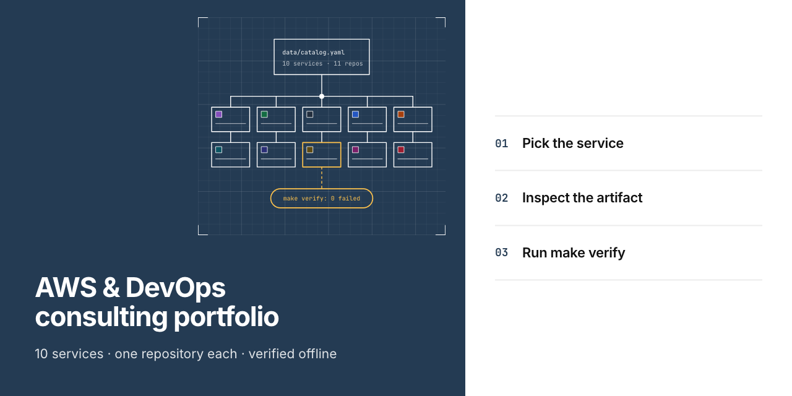

## What this proves

- Each of the ten services links a repository that holds a report, runbook or working code as evidence beyond the
  service description.
- A single `make verify` command in each service repository checks its evidence offline without an AWS account
  or credentials.
- Common requirements govern repository files, README section order, ADR format and descriptions. This repository
  checks compliance across the collection.
- Every repository marks its deliverables as fictional, using Harbor Goods, a fictional mid-size retailer, and
  example account IDs from AWS documentation.

## Inspect the deliverable

Choose the service closest to your problem, then follow its card to the repository, the first artifact to review
and the service on Upwork.

<!-- BEGIN GENERATED: cards from data/catalog.yaml, run `make readme` -->

| Service | Repository | Strongest artifact |
| --- | --- | --- |
| [Terraform on AWS audit and fix](#terraform-on-aws-audit-and-fix) | [`terraform-aws-rescue-lab`](https://github.com/gamaware/terraform-aws-rescue-lab) | [Diagnosis report](https://github.com/gamaware/terraform-aws-rescue-lab/blob/main/report/REPORT.md) |
| [CI/CD pipeline to AWS](#cicd-pipeline-to-aws) | [`github-actions-aws-oidc-lab`](https://github.com/gamaware/github-actions-aws-oidc-lab) | [Deploy workflow](https://github.com/gamaware/github-actions-aws-oidc-lab/blob/main/.github/workflows/deploy.yml) |
| [AWS security and IAM review](#aws-security-and-iam-review) | [`aws-iam-security-review-sample`](https://github.com/gamaware/aws-iam-security-review-sample) | [Security review report](https://github.com/gamaware/aws-iam-security-review-sample/blob/main/report/REPORT.md) |
| [Kubernetes on Amazon EKS](#kubernetes-on-amazon-eks) | [`terraform-aws-eks-gitops-lab`](https://github.com/gamaware/terraform-aws-eks-gitops-lab) | [EKS module](https://github.com/gamaware/terraform-aws-eks-gitops-lab/tree/main/infra/terraform/modules/eks) |
| [Containerize and deploy to ECS Fargate](#containerize-and-deploy-to-ecs-fargate) | [`aws-ecs-fargate-deploy-lab`](https://github.com/gamaware/aws-ecs-fargate-deploy-lab) | [ECS service definition](https://github.com/gamaware/aws-ecs-fargate-deploy-lab/blob/main/infra/terraform/service/ecs.tf) |
| [AWS landing zone for a new project](#aws-landing-zone-for-a-new-project) | [`terraform-aws-landing-zone-lab`](https://github.com/gamaware/terraform-aws-landing-zone-lab) | [Service control policies](https://github.com/gamaware/terraform-aws-landing-zone-lab/tree/main/policies/scp) |
| [DevOps and Well-Architected assessment](#devops-and-well-architected-assessment) | [`aws-well-architected-assessment-sample`](https://github.com/gamaware/aws-well-architected-assessment-sample) | [Assessment report](https://github.com/gamaware/aws-well-architected-assessment-sample/blob/main/report/REPORT.md) |
| [AWS cost optimization audit](#aws-cost-optimization-audit) | [`aws-cost-optimization-audit-sample`](https://github.com/gamaware/aws-cost-optimization-audit-sample) | [Cost audit report](https://github.com/gamaware/aws-cost-optimization-audit-sample/blob/main/report/REPORT.md) |
| [Migration to AWS](#migration-to-aws) | [`aws-migration-runbook-sample`](https://github.com/gamaware/aws-migration-runbook-sample) | [Wave 1 cutover runbook](https://github.com/gamaware/aws-migration-runbook-sample/blob/main/runbooks/wave-1-cutover.md) |
| [AWS workshop and mentoring](#aws-workshop-and-mentoring) | [`aws-devops-workshop-labs`](https://github.com/gamaware/aws-devops-workshop-labs) | [Labs](https://github.com/gamaware/aws-devops-workshop-labs/tree/main/labs) |

### Terraform on AWS audit and fix

[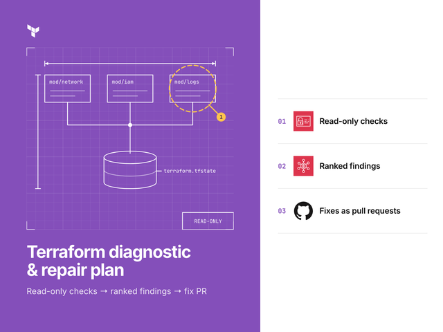](https://github.com/gamaware/terraform-aws-rescue-lab)

- **Client problem:** Terraform nobody trusts: local state, copy-pasted environments and plans that could delete
  production data.
- **Repository:** [`terraform-aws-rescue-lab`](https://github.com/gamaware/terraform-aws-rescue-lab), lab
- **Strongest artifact:** [Diagnosis
  report](https://github.com/gamaware/terraform-aws-rescue-lab/blob/main/report/REPORT.md). 10 findings ranked by risk,
  each with evidence and a fix, plus the repair order and a state migration.
- **Verification scope:** Checkov and tflint counts before and after, terraform test with a mocked provider and
  plan-gate fixtures, all offline; `make demo` replays the state migration against a local emulator.
- **Upwork offer:** [Terraform on AWS audit and fix on Upwork](https://www.upwork.com/freelancers/~014b3520cf9e140103)

### CI/CD pipeline to AWS

[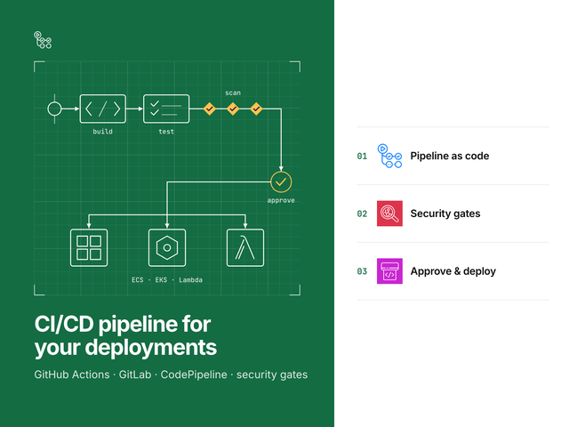](https://github.com/gamaware/github-actions-aws-oidc-lab)

- **Client problem:** Long-lived AWS keys in CI, and deploys that can ship an image nobody scanned.
- **Repository:** [`github-actions-aws-oidc-lab`](https://github.com/gamaware/github-actions-aws-oidc-lab), lab
- **Strongest artifact:** [Deploy
  workflow](https://github.com/gamaware/github-actions-aws-oidc-lab/blob/main/.github/workflows/deploy.yml). Build once,
  Trivy gate, OIDC role, push by digest, deploy, then fail the run if ECS rolled back.
- **Verification scope:** pytest policy tests, mocked terraform test, tflint, Checkov, actionlint and zizmor, with no
  AWS credentials.
- **Upwork offer:** [CI/CD pipeline to AWS on Upwork](https://www.upwork.com/freelancers/~014b3520cf9e140103)

### AWS security and IAM review

[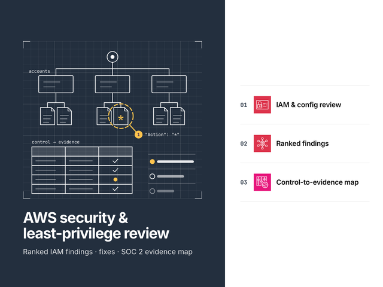](https://github.com/gamaware/aws-iam-security-review-sample)

- **Client problem:** An account that grew without an access model, with administrator CI roles, root keys and public
  buckets.
- **Repository:** [`aws-iam-security-review-sample`](https://github.com/gamaware/aws-iam-security-review-sample),
  fictional sample deliverable
- **Strongest artifact:** [Security review
  report](https://github.com/gamaware/aws-iam-security-review-sample/blob/main/report/REPORT.md). 9 ranked findings with
  evidence, impact and policy rewrites, then quick wins and a baseline SCP.
- **Verification scope:** 17 offline checks and Checkov run on the account before and after the fixes; CI regenerates
  the evidence and diffs it.
- **Upwork offer:** [AWS security and IAM review on Upwork](https://www.upwork.com/freelancers/~014b3520cf9e140103)

### Kubernetes on Amazon EKS

[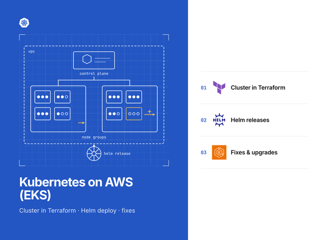](https://github.com/gamaware/terraform-aws-eks-gitops-lab)

- **Client problem:** A team that needs Kubernetes on AWS without a hand-built cluster or a branch per environment.
- **Repository:** [`terraform-aws-eks-gitops-lab`](https://github.com/gamaware/terraform-aws-eks-gitops-lab), lab
- **Strongest artifact:** [EKS
  module](https://github.com/gamaware/terraform-aws-eks-gitops-lab/tree/main/infra/terraform/modules/eks). Cluster,
  access entries, add-ons and Pod Identity per controller, with mocked terraform test runs.
- **Verification scope:** Mocked terraform test, Helm lint and render assertions, and kubeconform schema checks; helm
  test needs a cluster and runs only live.
- **Upwork offer:** [Kubernetes on Amazon EKS on Upwork](https://www.upwork.com/freelancers/~014b3520cf9e140103)

### Containerize and deploy to ECS Fargate

[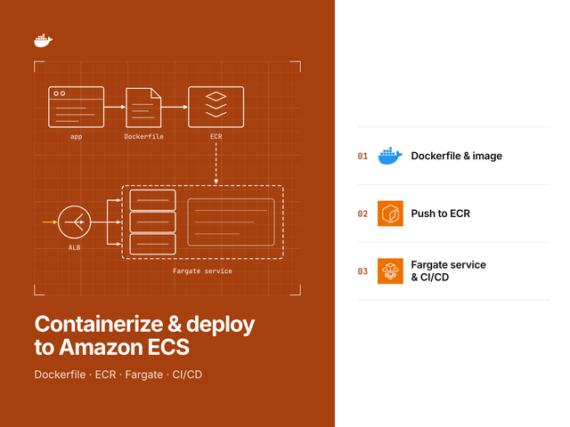](https://github.com/gamaware/aws-ecs-fargate-deploy-lab)

- **Client problem:** An application that runs on one machine and needs a repeatable, reversible path to AWS.
- **Repository:** [`aws-ecs-fargate-deploy-lab`](https://github.com/gamaware/aws-ecs-fargate-deploy-lab), lab
- **Strongest artifact:** [ECS service
  definition](https://github.com/gamaware/aws-ecs-fargate-deploy-lab/blob/main/infra/terraform/service/ecs.tf). Task
  hardening, the deployment circuit breaker and alarm-based rollback in one Terraform file.
- **Verification scope:** App tests, mocked terraform test, Checkov, Trivy and hadolint, plus a smoke test of the image
  under ECS constraints.
- **Upwork offer:** [Containerize and deploy to ECS Fargate on
  Upwork](https://www.upwork.com/freelancers/~014b3520cf9e140103)

### AWS landing zone for a new project

[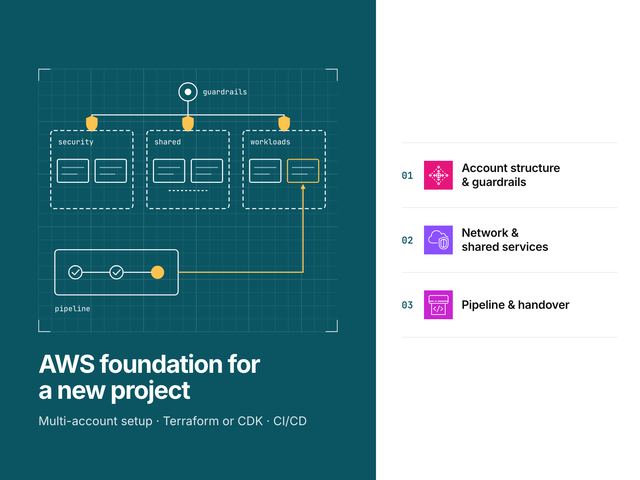](https://github.com/gamaware/terraform-aws-landing-zone-lab)

- **Client problem:** A new project that starts in one AWS account, with shared administrator access and no audit trail.
- **Repository:** [`terraform-aws-landing-zone-lab`](https://github.com/gamaware/terraform-aws-landing-zone-lab), lab
- **Strongest artifact:** [Service control
  policies](https://github.com/gamaware/terraform-aws-landing-zone-lab/tree/main/policies/scp). The guardrails, each
  tested against the requests it must deny or allow.
- **Verification scope:** Mocked terraform test for every module, SCP evaluation tests, tflint and Checkov, with no AWS
  credentials.
- **Upwork offer:** [AWS landing zone for a new project on
  Upwork](https://www.upwork.com/freelancers/~014b3520cf9e140103)

### DevOps and Well-Architected assessment

[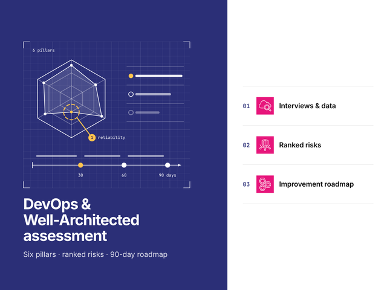](https://github.com/gamaware/aws-well-architected-assessment-sample)

- **Client problem:** A team that ships often, recovers slowly and cannot tell which risk to fix first.
- **Repository:**
  [`aws-well-architected-assessment-sample`](https://github.com/gamaware/aws-well-architected-assessment-sample),
  fictional sample deliverable
- **Strongest artifact:** [Assessment
  report](https://github.com/gamaware/aws-well-architected-assessment-sample/blob/main/report/REPORT.md). Scores across
  six pillars and the DevOps lens, the ranked backlog, the roadmap and an evidence register.
- **Verification scope:** Scripts regenerate every table from the recorded answers, and an independent test
  implementation recomputes each number.
- **Upwork offer:** [DevOps and Well-Architected assessment on
  Upwork](https://www.upwork.com/freelancers/~014b3520cf9e140103)

### AWS cost optimization audit

[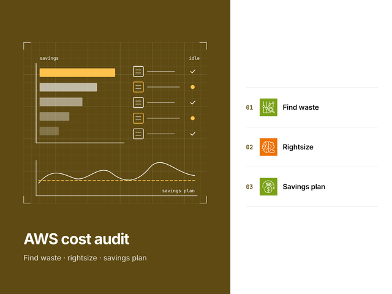](https://github.com/gamaware/aws-cost-optimization-audit-sample)

- **Client problem:** An AWS bill that grows every month with no owner for most of the spend.
- **Repository:**
  [`aws-cost-optimization-audit-sample`](https://github.com/gamaware/aws-cost-optimization-audit-sample), fictional
  sample deliverable
- **Strongest artifact:** [Cost audit
  report](https://github.com/gamaware/aws-cost-optimization-audit-sample/blob/main/report/REPORT.md). Ranked savings
  split into quick wins and planned work, commitment sizing, tagging plan and assumptions.
- **Verification scope:** Calculation tests derive each saving again from hours, rates and gigabytes; CI checks the
  evidence and the PDF against a fresh run.
- **Upwork offer:** [AWS cost optimization audit on Upwork](https://www.upwork.com/freelancers/~014b3520cf9e140103)

### Migration to AWS

[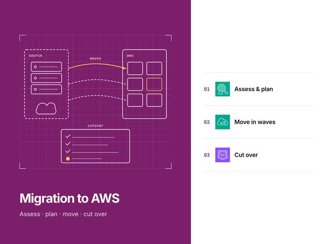](https://github.com/gamaware/aws-migration-runbook-sample)

- **Client problem:** A data-center application that must move to AWS with a short outage and a way back.
- **Repository:** [`aws-migration-runbook-sample`](https://github.com/gamaware/aws-migration-runbook-sample), fictional
  sample deliverable
- **Strongest artifact:** [Wave 1 cutover
  runbook](https://github.com/gamaware/aws-migration-runbook-sample/blob/main/runbooks/wave-1-cutover.md). Timed steps
  with checkpoints, rollback triggers, validation queries and acceptance criteria.
- **Verification scope:** Plan and runbook rules, pytest, mocked terraform test, TFLint and Checkov, with no AWS
  credentials.
- **Upwork offer:** [Migration to AWS on Upwork](https://www.upwork.com/freelancers/~014b3520cf9e140103)

### AWS workshop and mentoring

[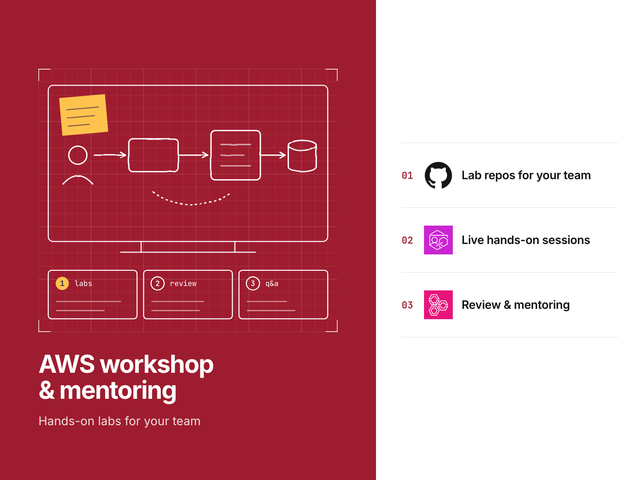](https://github.com/gamaware/aws-devops-workshop-labs)

- **Client problem:** A team that needs hands-on practice with AWS, Terraform, CDK or CI/CD before it changes its own
  systems.
- **Repository:** [`aws-devops-workshop-labs`](https://github.com/gamaware/aws-devops-workshop-labs), teaching labs
- **Strongest artifact:** [Labs](https://github.com/gamaware/aws-devops-workshop-labs/tree/main/labs). Numbered labs,
  each with objectives, starter code, a solution, tests and reset steps.
- **Verification scope:** Each lab's tests run against its solution with no AWS account.
- **Upwork offer:** [AWS workshop and mentoring on Upwork](https://www.upwork.com/freelancers/~014b3520cf9e140103)

### More

- [`cdk-python-nag-pipeline-lab`](https://github.com/gamaware/cdk-python-nag-pipeline-lab), lab: An AWS CDK v2 app in
  Python whose pipeline stops on any unacknowledged cdk-nag finding during synth.

<!-- END GENERATED: cards -->

## Scenario and acceptance criteria

A buyer or CTO needs to assess the work supporting a service in a few minutes, while an engineer needs to run it
before a call. Both depend on this index keeping its information accurate as eleven repositories evolve on
separate schedules.

Each repository in this portfolio is a separate engagement with Harbor Goods, a fictional mid-size retailer. Details
such as its accounts and systems belong to that engagement and do not carry over between repositories.

For the index to pass its checks:

- each service listed in [`data/catalog.yaml`](data/catalog.yaml) must have a corresponding card with matching
  information;
- each catalog entry must point to an existing repository containing `README.md`, `LICENSE`, `CHANGELOG.md`,
  two or more ADRs and `docs/assets/cover.png`;
- each README must use the prescribed section order and include a link to this index;
- each card must use a cover derived from its repository's current cover;
- each artifact link must resolve to the file at the specified path;
- each repository must follow the description template "Demonstrates *capability* through *artifact*;
  verified *scope*." and include `aws`, `devops`, `portfolio` and its type topic among its topics.

All these checks run offline through `make verify`. The [check documentation](docs/checks.md) pairs each check
with the rule behind it.

## Architecture

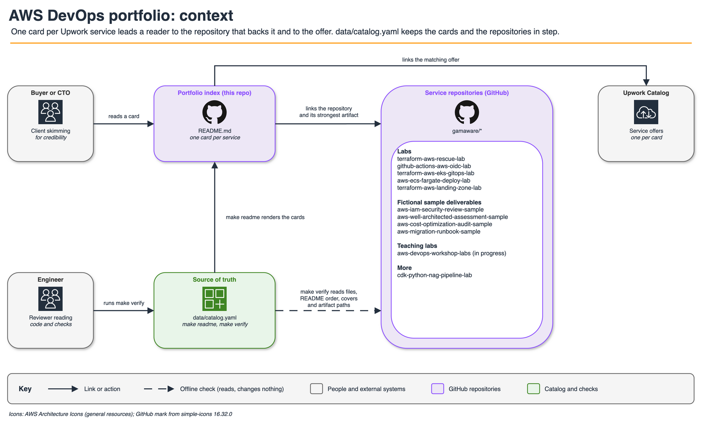

Service descriptions have a single source: [`data/catalog.yaml`](data/catalog.yaml). From that catalog,
`make readme` generates this README's cards. To check their accuracy, `make verify` inspects local checkouts of
the sibling repositories. CI first clones the public repositories into a temporary directory, and a weekly
scheduled run repeats the check so a change in a listed repository shows up here too.

A separate command, `make test-live`, compares the catalog against GitHub's live settings without modifying them.
The diagram's draw.io source lives at
[`docs/diagrams/portfolio-context.drawio`](docs/diagrams/portfolio-context.drawio).

## Verify locally

Local verification requires GNU Make, sibling repository checkouts beside this repository, and
[uv](https://docs.astral.sh/uv/) 0.12.19, the version CI pins. uv installs Python 3.13 along with the packages
pinned in `uv.lock`. Verification requires neither an AWS account nor credentials.

```bash
make setup    # install the pinned toolchain into .venv
make verify   # ruff, pytest, then the catalog check across every repository
```

For checkouts in another location, `REPOS_ROOT` specifies their parent directory; alternatively, the CI script
can clone the repositories:

```bash
REPOS_ROOT=/tmp/portfolio scripts/clone-siblings.sh
make verify REPOS_ROOT=/tmp/portfolio
```

A successful run ends with the check count and the success line:

```text
pass  cdk-python-nag-pipeline-lab: required files
78 passed, 0 failed, 0 skipped
verify: all checks passed
```

After the initial `uv sync`, verification takes approximately five seconds.

The optional `make test-live` command runs manually and makes no changes. Using the token supplied by
`gh auth token`, it queries the GitHub API for each repository's description, topics, visibility and social
preview. Because this repository provisions no AWS resources, the live test accesses no AWS account.

## Repository map

```text
.
├── data/catalog.yaml          # services, offers, repositories, descriptions and topics
├── assets/                    # card covers, 640x480 copies of each repository cover
├── scripts/portfolio_check/   # model, README rules, card rendering, checks, cover copy, live comparison
├── scripts/clone-siblings.sh  # clones every listed repository for CI
├── tests/                     # pytest for every rule, on fixtures and on the real catalog
├── docs/checks.md             # each check and the rule it enforces
├── docs/adr/                  # decisions
├── docs/diagrams/             # context diagram, draw.io source and PNG
└── docs/assets/               # social preview and its spec
```

## Decisions and trade-offs

Architecture decision records follow the *Fundamentals of Software Architecture* (2nd ed.) format.

| Number | Title | Status |
| --- | --- | --- |
| [0001](docs/adr/0001-generate-cards-from-catalog.md) | Generate the service cards from one catalog file | Accepted |
| [0002](docs/adr/0002-check-sibling-repositories-offline.md) | Check the sibling repositories offline from local clones | Accepted |
| [0003](docs/adr/0003-card-covers-in-plain-markdown.md) | Keep card covers as small copies in plain Markdown | Accepted |
| [0004](docs/adr/0004-read-only-live-comparison.md) | Compare with live GitHub settings only on demand, read-only | Accepted |

## Security and quality gates

CI invokes shared workflows from [gamaware/.github](https://github.com/gamaware/.github) at a pinned commit SHA
before executing `make verify`:

| Check | Purpose |
| --- | --- |
| `lint-docs`: markdownlint, lychee, Vale | Prevent broken links from undermining the index |
| `lint-actions`: actionlint, zizmor | Keep workflow access narrow and free of injection |
| `secrets`: gitleaks | Keep credentials out of repository history |
| `security`: Semgrep, Trivy | Check Python scripts and dependencies for security issues |
| `verify`: ruff, pytest, catalog check | Confirm agreement between repository contents and cards |

Jobs receive neither cloud credentials nor an `id-token`. Pre-commit checks cover file hygiene, detect-secrets,
gitleaks, markdownlint, actionlint, zizmor, shellcheck, shellharden, ruff and conventional commits.
The `main` branch runs OpenSSF Scorecard.

## Limits and production adaptations

- Verification establishes that the named report path exists and that README sections follow the required
  order. It makes no assessment of report quality.
- Card numbers come directly from repository READMEs. Comparisons with source repositories cover only artifact
  paths and cover images.
- Upwork offer URLs are not stable and Upwork blocks automated requests, so each card links the Upwork profile and
  verification does not retrieve Upwork pages.
- Public repositories and a GitHub token are prerequisites for `make test-live`. The command reports differences
  without correcting them.

## Related work

- Alex Garcia's Upwork profile: [upwork.com/freelancers/~014b3520cf9e140103](https://www.upwork.com/freelancers/~014b3520cf9e140103).
- [gamaware/.github](https://github.com/gamaware/.github) contains the shared workflows, community files and
  social preview generator.
- The method is the one Alex uses in audits for ITESO and freelance clients in Guadalajara. Every finding in the
  samples comes from fictional data.
- Further repository information appears in the [change history](CHANGELOG.md) and [security policy](SECURITY.md).

## License

[MIT](LICENSE)
